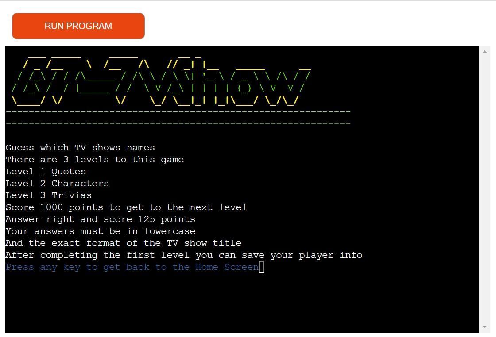
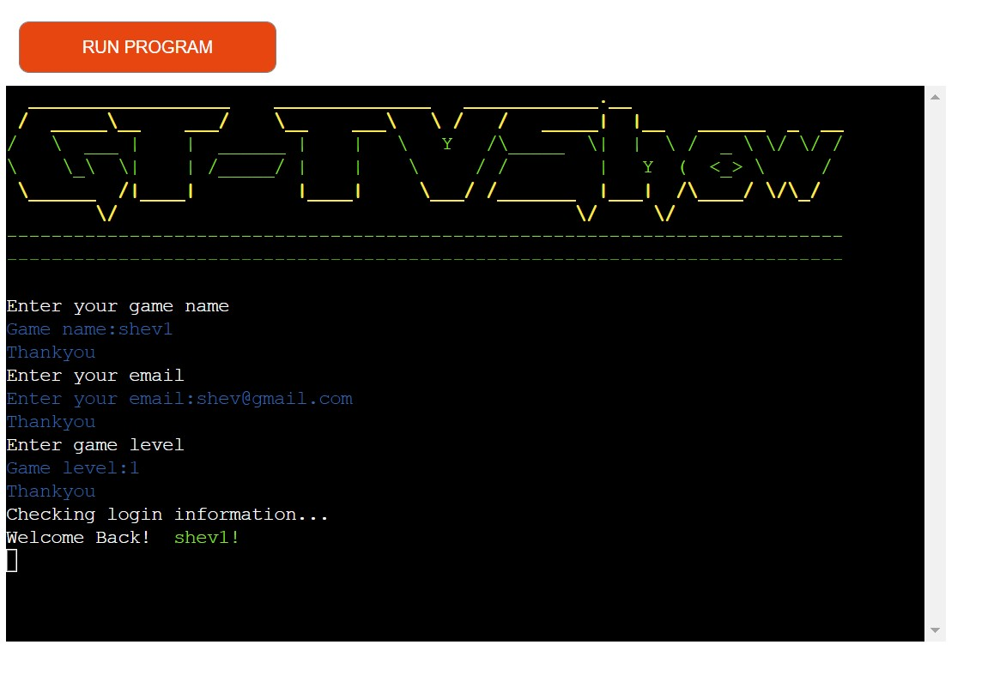
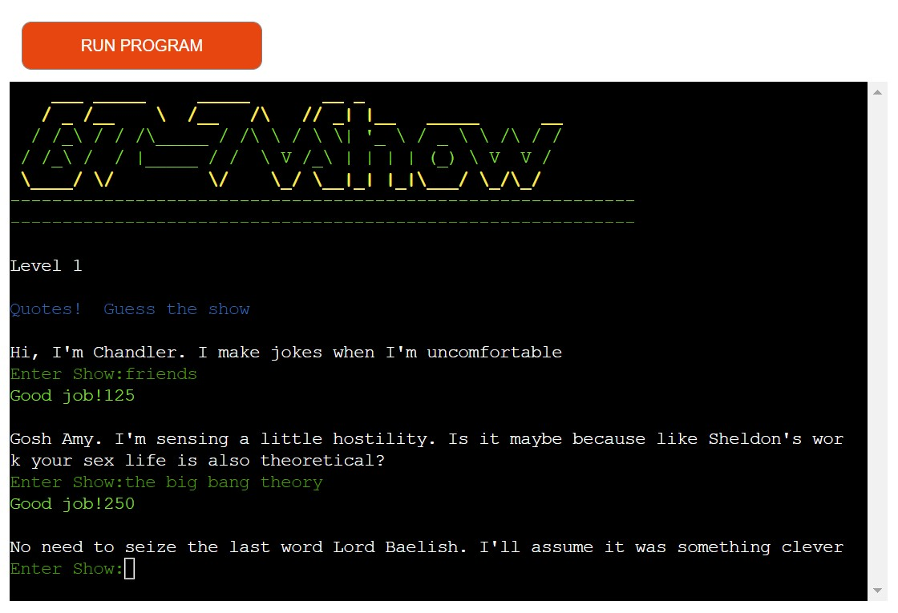
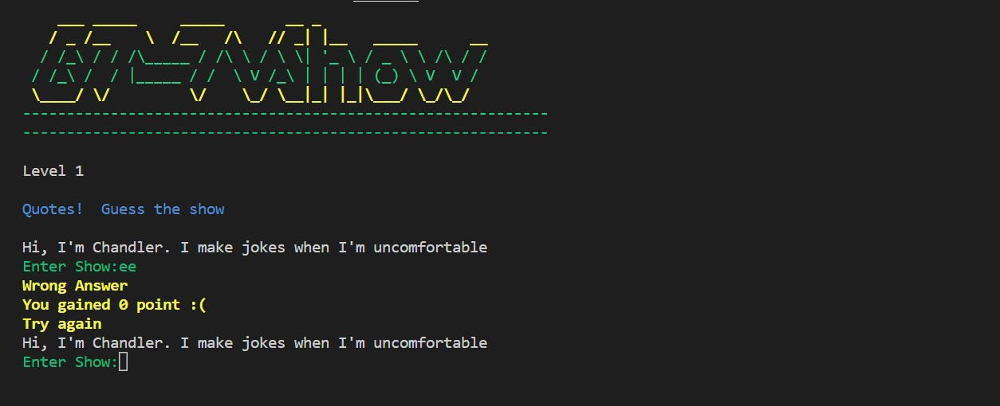
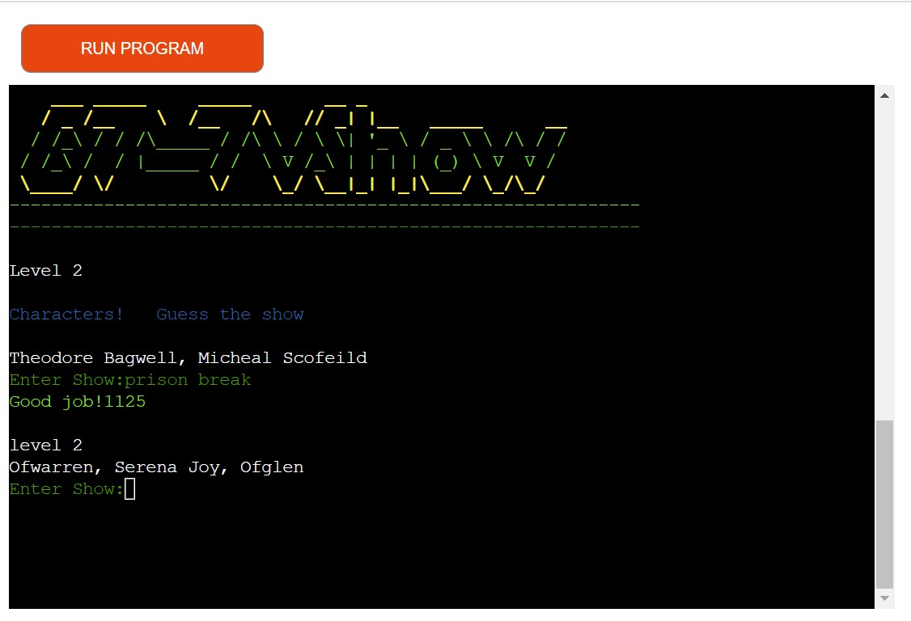
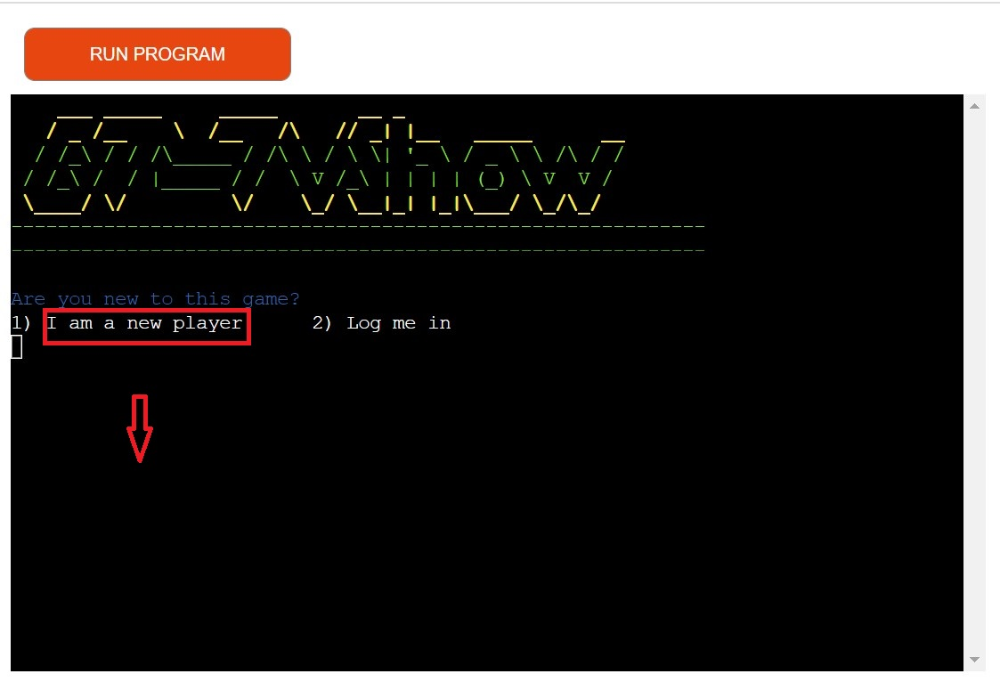
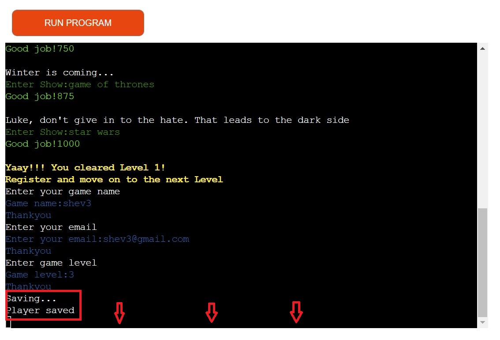

# Guess That TVshow
(Developer: Ewart Hestick)

[Live webpage](https://guess-that-tvshow2.herokuapp.com/)

## Table of Content

1. [Project Goals](#project-goals)
    1. [User Goals](#user-goals)
    2. [Site Owner Goals](#site-owner-goals)
2. [User Experience](#user-experience)
    1. [Target Audience](#target-audience)
    2. [User Stories](#user-stories)
3. [Technical Design](#technical-design)
    1. [Flowchart](#flowchart)
4. [Technologies Used](#technologies-used)
    1. [Languages](#languages)
    2. [Frameworks & Tools](#frameworks-&-tools)
    3. [Python Libraries](#python-libraries)
    4. [Third Party Libraries](#third-party-libraries)
5. [Features](#features)
    1. [Intro](#intro)
    2. [Menu](#menu)
    3. [Game Instructions](#game-instructions)
    4. [Play Options](#play-options)
    5. [Log-in](#log-in)
    6. [Sign-up](#sign-up)
    7. [User Greetings](#users-greetings)
    8. [Game](#game)
    9. [Game Levels](#game-levels)
    10. [End Game](#end-game)
    11. [User Input Validation](#user-input-validation)
6. [Validation](#validation) 
7. [Testing user stories](#testing-user-stories)
8. [Bugs](#Bugs)
9. [Deployment](#deployment)
10. [Credits](#credits)
11. [Acknowledgements](#acknowledgements)

## Project Goals 

### User Goals

- Play a fun quiz game
- Get high scores and high levels
- Be able to log a game name
- Return and login with access to higher levels

### Site Owner Goals

- Create a quiz game that is fun and responsive
- Have user be able to create a profile
- Have a response to every user input in the game
- Ensure the user know how the game is played

## User Experience

### Target Audience

- All audience
- Recommened 10yrs and older

### User Stories

#### First-time User 
1. I want to feel welcome
2. I want to have option to view game instructions
3. I want to see my scores
4. I want to know when i make a wrong input
5. I want to get a feedback when I win the game

#### Returning User
 
 6. As a retrun user I want to have an easy login option
 7. As a returned user I want to have access to different levels
 
#### Site Owner 

8.  As a owner I want the users to have navigation options 
9.  As a owner I want user to have the option to have a player name and save a profile
10. As a site owner I want users info to be save and accessed in a Google Spread Sheet
11. As a site owner  I want the user to be able to restart game or level

## Technical Design

### Flowchart

- Flowchart to site logic and structure 

 

Flowchart

   
   

## Technologies Used

### Languages

- Python

### Frameworks & Tools

- Git: was used for version control within VSCode to push the code to GitHub
- GitHub: was used as a remote repository to store project code
- Google Cloud: was used to manage access and permissions to the Google Services such as Google auth, sheets etc.
- Google Sheets: were used to store players details
- Heroku: was used to deploy the project into live environment
- PEP8: was used to check my code against Python conventions
- VSCode: VSCode was used to write the project code using Code Institute template 
- [Diagrams.net](https://app.diagrams.net/) was used to draw flowchart

### Python Libraries

- os: used to clear terminal
- time & sleep: used to displayed delayed messages in the terminal 

### Third Party Libraries

- colorama - I used colorama to add contrast to the game with OKGREEN and FAIL red to signal user answers and error messages
- email_validator - I used email_validator to user input email and raise error if the required input format is incorrect 
- gspread -  I used gspread to add and manipulate data in my Google spreadsheet and to interact with Google APIs
- google.oauth2.service_account  - JUSTIFICATION: module used to set up the authentification needed to access the Google API and connect my Service Account with the Credentials function. A login.json file is created with all details the API needs to access the google account. In deployment to heroku this information is stored in the config var section.

## Features

### Intro 
  The Intro displays game logo, prints a  welcome message at comforting speed and gives the option to begin. 
- Colorful logo
- Welcome message
- Option to begin
  

Screenshots

   
   

### Menu
   The Menu come after the Intro and gives the user the option to read the game instructions or move forward to play the game.
- Gives option to see game instructions
- Raise error if options input values are not to the required format
- Give option to play game
 

Screenshots

   
   

### Game Instructions
   The game in structure discribes the game and how it is play and will return to the Menu display at the press of any button.
- Instruction on how game is played
- Option to return to menu
  

Screenshots

   
   

### Play Options
   The Play option comes after the palyer read the instructions and opt to play game. This gives the user options to play as a new player or login if they have an existing profile.
- Play game as a new player
- Raise error if options input values are not to the required format
- Login as a return player
  

Screenshots

   
   

### Log-in
   After logging in by input of game name, email and level. This will be varified with a welcome message if the player exist and give the option to choose game lvels to play. If profile does not exist, then an error message will be displayed.
- Enter your saved game info
- Validates user input values
- Raise error in info does not exist
- Option to choose game level to play
  

Screenshots

   
   
   
   

### Sign-up
   After completing level one the player is allowed to create a profile by inputing a game name, email address and game level which will be saved to a google spraed sheet.
- After completing Level 1, create a game profile
- Validates user input values
- Save name, email and level to a google spread sheet
  

Screenshots

    
   
   

### Users Greetings
  Greeting message is displayed to welcome all user at the Intro display and a greeting message to wlecome back returning player which give a warm feel.
- Give welcome back message to return user
  

Screenshots

   
   
   

### Game
   The game print one of eight question, asks for an answer and gives you a score of 125 if your answer is right and an fault message if it is incorrect
- Print one out of eight question one after the other
- Give feedback for input answer 
- Show score for answers
- Complete level 1 and create your profile
- Score 1000 points to get to different levels
  

Screenshots

   
   
   

### Game Levels
  The game faetures three levels with 3 cateogories Quotes, Characters and Trivia
- Three game levels
  

Screenshots

   
   
   
   

### Restart game
   The restart game give the player the option to reset the current game level or exit to the game main menu
- Input 3 to restart game level
- Input 4 to reset game
   

Screenshots

   
   
   

### User Input Validation
- Raise error if name input values are not to the required format
- Raise error if email input values are not to the required format
- Raise error if level input values are not to the required format
- Raise error if return user input info does not exist
- Raise error if options input values are not to the required format
   

Screenshots

   
   
   
   
   
   
   

## Validation
   
   

PEP8CI check run.py 

   
   

   

PEP8CI check login.py

   
   

   

PEP8CI check questionanswer_lev_one.py

   
   

   

PEP8CI colors.py

   
   

### Testing user stories

1. I want to feel welcome

   | **Feature** | **Action** | **Expected Result** | **Actual Result** |
   |-------------|------------|---------------------|-------------------|
   | Color contrast |  Welcome message | Comforting load speed | Works as expected |

   

Screenshots

   
   

2.  I want to have option to view game instructions

    | **Feature** | **Action** | **Expected Result** | **Actual Result** |
    |-------------|------------|---------------------|-------------------|
    | Menu | Input 1   | Display instructions or Play game options | Works as expected |

     

Screenshots

     
     
     
     

3. I want to see my scores
   | **Feature** | **Action** | **Expected Result** | **Actual Result** |
   |-------------|------------|---------------------|-------------------|
   | Game page |Input correct answer  | Score adds up below answer input | Works as expected |
     

Screenshots

     
     

4. I want to know when i make a wrong input

   | **Feature** | **Action** | **Expected Result** | **Actual Result** |
   |-------------|------------|---------------------|-------------------|
   | Error message | Wrong input or wrong input format   | Red colored text error messages | Works as expected |
    

Screenshots

    
    
    
    
    
    
    

5. I want to get a feedback when I win the game
   | **Feature** | **Action** | **Expected Result** | **Actual Result** |
   |-------------|------------|---------------------|-------------------|
   | Game page | Complete level | You win message | Works as expected |

    

Screenshots

    
    

6. As a return user I want to have an easy login option   
   | **Feature** | **Action** | **Expected Result** | **Actual Result** |
   |-------------|------------|---------------------|-------------------|
   | Menu, Play game, Choose level display | Input 1 or 2  | Selected option displayed | Works as expected |

     

Screenshots

     
     
     
     
     
     

7. As a return user I want to have access to different levels

   | **Feature** | **Action** | **Expected Result** | **Actual Result** |   
   |-------------|------------|---------------------|-------------------|
   | Return player option | Input 2 and enter profile info | Sart level 1 or 2  | Works as expected |

     

Screenshots

     
     
     
     
     
     
     
     
     

8.  As a owner I want the users to have navigation options 

    | **Feature** | **Action** | **Expected Result** | **Actual Result** |
    |-------------|------------|---------------------|-------------------|
    | Menu and Play game display | Enter required option input| Display the next game section | Works as expected |

    

Screenshots

    
    
    
    
    
    
    
    

9.  As a owner I want user to have the option to have a player name and save a profile

    | **Feature** | **Action** | **Expected Result** | **Actual Result** |
    |-------------|------------|---------------------|-------------------|
    | Play game options | Input 1, cpomplete level 1 and input info | Player profile save | Works as expected |

    

Screenshots

    
    
    
    
    
    
    

10. As a site owner I want users info to be save and accessed in a Google Spread Sheet

    | **Feature** | **Action** | **Expected Result** | **Actual Result** |
    |-------------|------------|---------------------|-------------------|
    | Google spread sheet | After level 1 completion fill out name, email and level input | save to google spread sheet | Works as expected |

     

Screenshots

     
     
     
     
     
     
     
     

    
## Bugs
- Bug: The site was deployed with an error message of unable to find login file 
  Fix: due to using "login.json" instead of "creds.json" default.js "env" setting needed to be changed from CREDS to LOGIN
- Bug: " E501 line too long" error during validation
  Fix: Re-write logo and game instructions
- Bug: Colorama module could not be found after deployment 
  Fix: "pip3 freeze > requirements.txt" was updated but was not pushed up to github
- Bug: email_validator could not be found after deployment
  Fix: "pip3 freeze > requirements.txt" needed updating
- Bug: During validation "E302 expected 2 blank lines" error was present
  Fix: Add second line between functions
- Bug: During validation "E203 whitespace before" in questionanswer_lev_one.py
  Fix: Delete extra space in dictionary

## Deployment

### Heroku
This application has been deployed from GitHub to Heroku by following the steps:

1. Create or log in to your account at heroku.com
2. Create a new app, add a unique app name (this project is named "guess-that-tvshow") and choose your region
3. Click on create app
4. Go to "Settings"
5. Under Config Vars store any sensitive data you saved in .json file. Name 'Key' field, copy the .json file and paste it to 'Value' field. Also add a key 'PORT' and value '8000'.
6. Add required buildpacks (further dependencies). For this project, I set up 'Python' and 'node.js' in that order.
7. Go to "Deploy" and select "GitHub" in "Deployment method"
8. To link up our Heroku app to our Github repository code enter your repository name, click 'Search' and then 'Connect' when it shows below
9.  Choose the branch you want to buid your app from
10. If prefered, click on "Enable Automatic Deploys", which keeps the app up to date with your GitHub repository
11. Wait for the app to build. Once ready you will see the “App was successfully deployed” message and a 'View' button to take you to your deployed link.

### Forking the GitHub Repository
1. Go to the GitHub repository
2. Click on Fork button in top right corner
3. You will then have a copy of the repository in your own GitHub account.
   
### Making a Local Clone
1. Go to the GitHub repository 
2. Locate the Code button above the list of files and click it
3. Highlight the "HTTPS" button to clone with HTTPS and copy the link
4. Open Git Bash
5. Change the current working directory to the one where you want the cloned directory
6. Type git clone and paste the URL from the clipboard ($ git clone https://github.com/YOUR-USERNAME/YOUR-REPOSITORY)
7. Press Enter to create your local clone

[Back to Table Of Contents](#table-of-contents)

## Credits
### Code
- [Stack overflow](https://stackoverflow.com/questions/20302331/typing-effect-in-python) helped with python essentials needed  
- [W3School](https://www.w3schools.com/) helped with python essentail needed
- [DEV](https://dev.to/) inspiration on "How to build a quizz game with python
- [Rishabh Singh](https://dev.to/mindninjax) inspiration on "How to build a quizz game with python
- [PYPI](https://pypi.org/) on how to install "email_validator" and colorama 
## Aknowledgements

- Code Institute community on Slack for resources and support
- My Mentor Mo for the guidance, tips and resources, also for challenging my limitsc
- My partner for giving the the time and being patient 